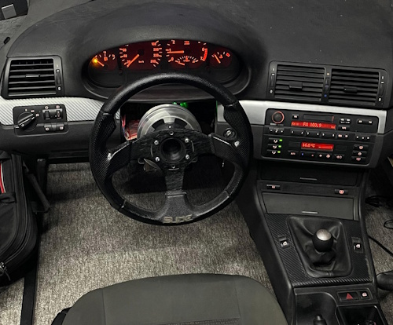

# Raspberry Pi Pico USB Joystick Controller for car Simrig

A comprehensive USB HID Joystick implementation for Raspberry Pi Pico with support for buttons, shifters, and analog pedals.

Vibe coded due to not having free time at all / spending such time on said Simrig HW :))



## Features

- **Direct Mapped Buttons** - Physical buttons directly mapped to joystick buttons with debouncing (hazards, DSC, handbrake...)
- **Edge-Triggered Buttons** - Momentary pulse (300ms) on state change (light switch)
- **Combo Button Groups** - Two-pin combinations with 200ms detection window (E46 window switches)
- **H-Pattern Shifter** - Analog stick shifter with reverse gear detection (Logitech or any other)
- **Analog Pedals** - 16-bit precision pedals via ADS1115 ADC with auto-calibration
- **EEPROM Storage** - Pedal calibration saved automatically
- **Calibration Reset** - Hold button to reset pedal calibration

## Hardware Requirements

- Raspberry Pi Pico
- ADS1115 16-bit ADC module (for pedals)
- Buttons/switches for input (pull-up mode)
- Shifter with potentiometers (G2x shifter)
- Pedals with potentiometers (G2x pedals)

## Required Libraries

Install these libraries via Arduino IDE Library Manager:

1. **[ezButton](https://github.com/ArduinoGetStarted/button)** - Button debouncing library
2. **[Joystick](https://github.com/benjaminaigner/Joystick)** (by earlephilhower) - USB HID Joystick for RP2040
3. **[ADS1115_WE](https://github.com/wollewald/ADS1115_WE)** - ADS1115 ADC library (only if using pedals)

## Pin Assignments

### Default Configuration Example

| Component | GPIO Pin | Function |
|-----------|----------|----------|
| I2C SDA | GP20 | ADS1115 Communication |
| I2C SCL | GP21 | ADS1115 Communication |
| Shifter X | GP26 (ADC0) | Analog X-axis |
| Shifter Y | GP27 (ADC1) | Analog Y-axis |
| Reverse | GP22 | Digital input (HIGH=Reverse, LOW=6th) |

**Note:** Direct buttons, edge buttons, and combo groups are configured in the code arrays.

## Configuration Guide

### 1. Enable/Disable Features

```cpp
#define ENABLE_SHIFTER true   // Set to false to disable shifter
#define ENABLE_PEDALS true    // Set to false to disable pedals
```

### 2. Direct Buttons

```cpp
DirectButton directButtons[] = {
  {2, 9},    // Pin GP2 -> Joystick Button 9
  {3, 10},   // Pin GP3 -> Joystick Button 10
  // Add more buttons here
};
```

### 3. Edge-Triggered Buttons

```cpp
EdgeButton edgeButtons[] = {
  {13, 16}   // Pin GP13 -> Button 16 (300ms pulse on state change)
};
```

### 4. Combo Button Groups

```cpp
ComboGroup comboGroups[] = {
  {5, 6, 1, 2, 3, 4},   // Pins GP5, GP6 -> Buttons 1-4
  // pin1, pin2, btn_p1_only, btn_combo_12, btn_p2_only, btn_combo_21
};
```

**Combo Logic:**
- Press Pin1 alone for 200ms → Button 1
- Press Pin1, then Pin2 within 200ms → Button 2
- Press Pin2 alone for 200ms → Button 3
- Press Pin2, then Pin1 within 200ms → Button 4

### 5. Shifter Configuration

```cpp
ShifterConfig shifter = {
  26,    // X_AXIS_PIN (GP26/ADC0)
  27,    // Y_AXIS_PIN (GP27/ADC1)
  22,    // REVERSE_PIN (GP22)
  320,   // X_LEFT_THRESHOLD
  600,   // X_RIGHT_THRESHOLD
  650,   // Y_TOP_THRESHOLD
  250,   // Y_BOTTOM_THRESHOLD
  {17, 18, 19, 20, 21, 22, 23, 24}  // Joystick buttons for gears 0-7
};
```

**Gear Mapping:**
```
     1   3   5
     |   |   |
     2   4   6/R

Gear 0 = Neutral (no button pressed)
Gear 7 = Reverse (bottom-right + HIGH on reverse pin)
```

### 6. Pedal Configuration

```cpp
PedalConfig pedals[NUM_PEDALS] = {
  {0, 3, 5},  // ADS1115 A0 -> Rx axis, 5% deadzone
  {2, 5, 3},  // ADS1115 A2 -> Rz axis, 3% deadzone
  {1, 4, 3}   // ADS1115 A1 -> Ry axis, 3% deadzone
  // channel, joystick_axis, deadzone_percent
};
```

## Wiring Guide

### Shifter Connection


### Pedal Connection (ADS1115)

```
ADS1115 Module          Raspberry Pi Pico
──────────────          ─────────────────
VDD ───────────────────> 3.3V
GND ───────────────────> GND
SDA ───────────────────> GP20
SCL ───────────────────> GP21

Potentiometer            ADS1115
───────────────────────  ───────
Pedal 1 ────────────────> A0
Pedal 2 ────────────────> A1
Pedal 3 ────────────────> A2
```


### Button Connections

All buttons use **internal pull-up** resistors:

```
Button/Switch           Raspberry Pi Pico
─────────────          ─────────────────
One side ──────────────> GPxx (configured pin)
Other side ────────────> GND

Pressed = LOW (connected to GND)
Released = HIGH (pulled up internally)
```

## Usage

### First Time Setup

1. Upload the code to your Raspberry Pi Pico
2. Connect your hardware according to the wiring guide
3. The pedals will auto-calibrate as you use them
4. Calibration is saved to EEPROM after 60 seconds of no changes

### Pedal Calibration

**Automatic Calibration:**
- Press each pedal fully a few times
- The min/max values are automatically learned
- Saved to EEPROM after 60 seconds

**Manual Reset:**
- Hold the **first direct button** (directButton[0]) for **10 seconds**
- All pedal calibration will reset to defaults
- Release button and recalibrate by pressing pedals

### Shifter Calibration

The shifter uses threshold values that you can adjust in the configuration:
- `X_LEFT_THRESHOLD`, `X_RIGHT_THRESHOLD` - Left/Center/Right positions
- `Y_TOP_THRESHOLD`, `Y_BOTTOM_THRESHOLD` - Top/Bottom positions